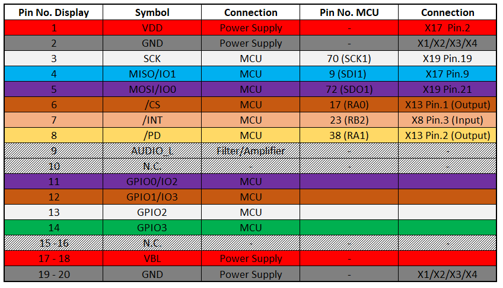
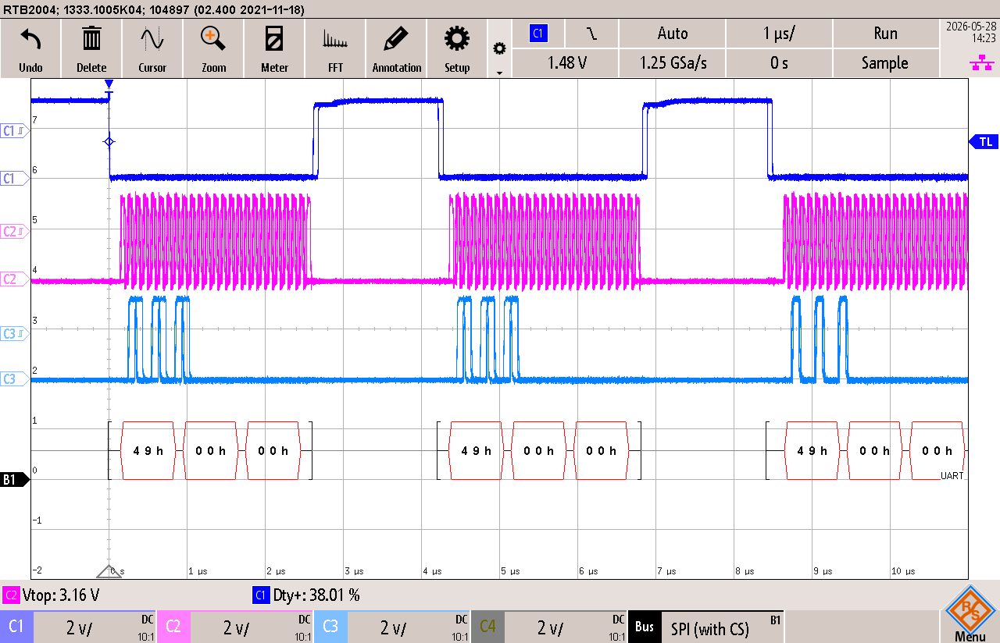
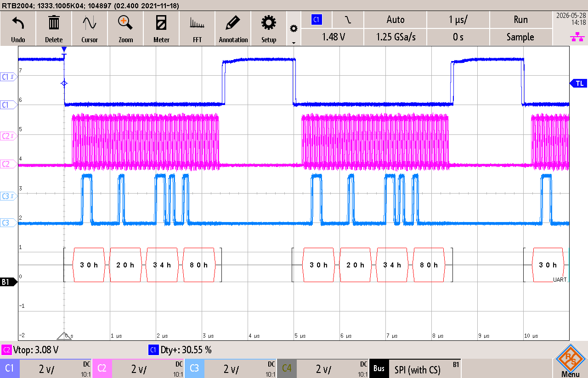
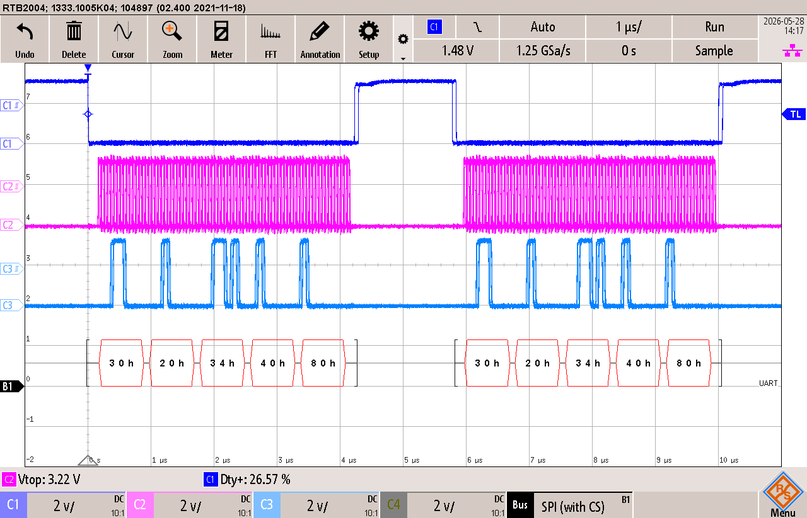
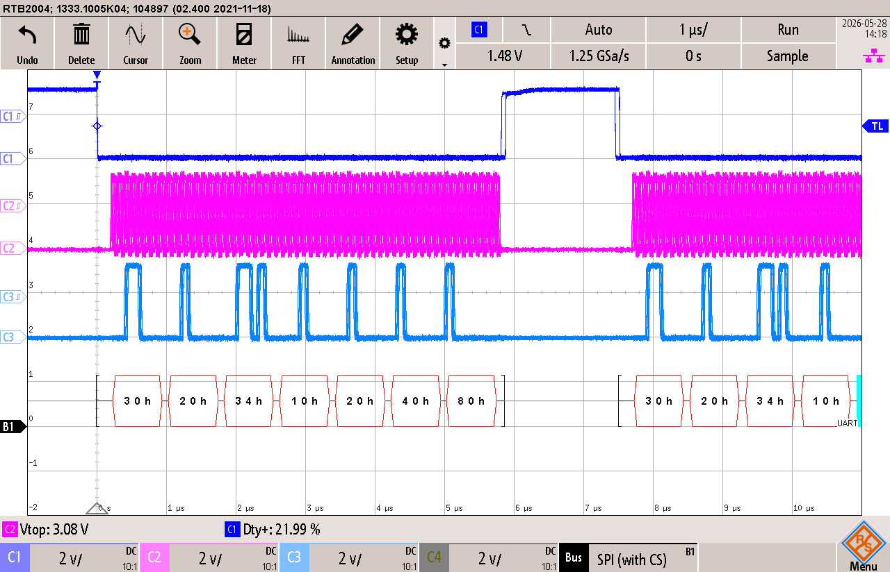

# 2418 Demonstrateur graphique
## Objectif

Développer une librairie complète pour pouvoir piloter l'écran **NHD-5.0R-FT812** avec le kit PIC32 de MINF.

## Versioning

**IDE**			: MPLABX IDE v6.15 
**Configurateur**	: Harmony v2.06 
**Compilateur**		: XC32 v2.50 
**OS**			: Windows 10 

## Emplacement fichier firmware

C:\microchip\harmony\v2_06\apps\PROJ\PRJ_2418_demosntrateurGraphique-\soft\2418_PMP\firmware

## Emplacement des datasheet du projet
PRJ_2418_demosntrateurGraphique-\doc\Doc_KSA\Doc_PMP

## Mise en place d'une librairie (Mc32DriverFT812)
### Envoie des **Host Command**
Les **Host Command** sont envoyées au moyen de la fonction **ft812_send_host_command**, le format d'envoi des commandes est donné dans le datasheet **DS**DS_FT81x** de **Bridgetek**.
Ces commandes sont utilisées pour commander le chip **FT812**, elles servent à le mettre en mode **SLEEP** ou pour le **RESET** par exemple.

(Source => Page.16 de DS_FT81x)

Toutes les commandes sont listées dans le même datasheet de la page 16 à la page 20.

### Timing characteristics du TFT
Les réglages de base donnés au FT812 dans la fonction d'initialisation proviennent de la page 7 du datasheet **NHD-5.0-800480F-CTXL-T**.

### Adresses FT812

Toutes les adresses de la FT812 proviennent du datasse **DS_FT81x** de **Bridgetek**.

| Nom du registre   | Adresse       | Description                           |
| ----------------- | ------------- |:-------------------------------------:|
| REG_HSIZE         | 0x302034      | Horizontal display pixel count        |
| REG_VSIZE         | 0x302048      | Vertical display line count           |
| REG_HCYCLE        | 0x30202C      | Horizontal total cycle count          |
| REG_HOFFSET       | 0x302030      | Horizontal display start offset       |
| REG_HSYNC0        | 0x302038      | Horizontal sync fall offset           |
| REG_HSYNC1        | 0x30203C      | Horizontal sync rise offset           |
| REG_VCYCLE        | 0x302040      | Vertical total cycle count            |
| REG_VOFFSET       | 0x302044      | Vertical display start offset         |
| REG_VSYNC0        | 0x30204C      | Vertical sync fall offset             |
| REG_VSYNC1        | 0x302050      | Vertical sync rise offset             |
| REG_PCLK          | 0x302070      | PCLK frequency divider, 0 = disable   |
| REG_DLSWAP        | 0x302054      | Display list swap control             |
| RAM_DL            | 0x300000      | Display List RAM                      |

### Tableau des connexions entre le KIT-ES-PIC32 et l'écran avec chip FT812

### Schéma de mesures pour le test des fonctions

### Configuration de l'oscilloscope pour les mesures SPI

### Test fonction **ft812_send_host_command** pour écrire une donnée 8bits sur le bus SPI
Description: Envoie des **Host command** sur le chip F812. 

Sur la mesure ci-dessous, on voit bien l'envoi d'une **Host commande**. Elle est composée dans l'ordre suivant [Host command][param host command][dummy byte].

### Test fonction **ft812_memory_write8**
Description: Ecriture d'une data de 1 octet sur la RAM du chip FT812 

Test d'envoie de la valeur **0x80** sur le bus SPI à 10MHz

Sur la mesure ci-dessus, nous pouvons bien voir l'écriture de la valeur **0x80** à l'adresse **0x302034**.

### Test fonction **ft812_memory_write16**
Description: Ecriture d'une data de 2 octets sur la RAM du chip FT812 

Test d'envoie de la valeur **0x8040** sur le bus SPI à 10MHz

Sur la mesure ci-dessus, nous pouvons bien voir l'écriture de la valeur **0x8040** à l'adresse **0x302034**.

### Test fonction **ft812_memory_write32**
Description: Ecriture d'une data de 4 octets sur la RAM du chip FT812 

Test d'envoie de la valeur **0x80402010** sur le bus SPI à 10MHz

Sur la mesure ci-dessus, nous pouvons bien voir l'écriture de la valeur **0x80402010** à l'adresse **0x302034**.

### Test fonction **ft812_memory_read8** pour lire une donnée 8bits sur le bus SPI
Description: Lécture de 1 octet sur le chip FT812

Lecture de REG_ID à l'adresse 0x302000 du chip ft812 pour test de la fonction.

Sur la mesure ci-dessus, nous pouvons voir l'envoi de l'adresse à lire **0x302000**, puis un envoi de **00** pour indiquer la fin de l'adresse, puis l'envoi d'un dummy byte pour la génération d'une clock. Au moment de la génération de la clock, nous pouvons voir que le chip FT812 nous répond la valeur attendue selon la datasheet qui est **0x7C**.

### Test fonction **ft812_init** pour écrire une donnée 8bits sur le bus SPI
Description: Initialisation du chip FT812  

Cette fonction est utilise les fonctions d'écriture sur le chip FT812 testé précédemment. 
Le fonctionnement de cette fonction n'est pas validé car le chip n'est pas initialisé et empêche d'effectuer une lecture de la RAM. 
J'ai pu confirmer qu'il s'agit bien d'un problème d'init car quand j'envoie une demande de l'écriture d'une adresse RAM, le chip ne reste pas silencieux mais répond une valeur d'erreur.