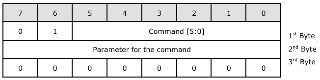
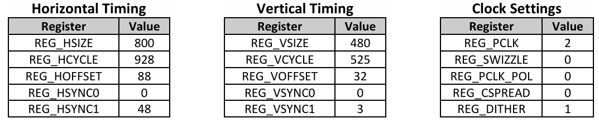
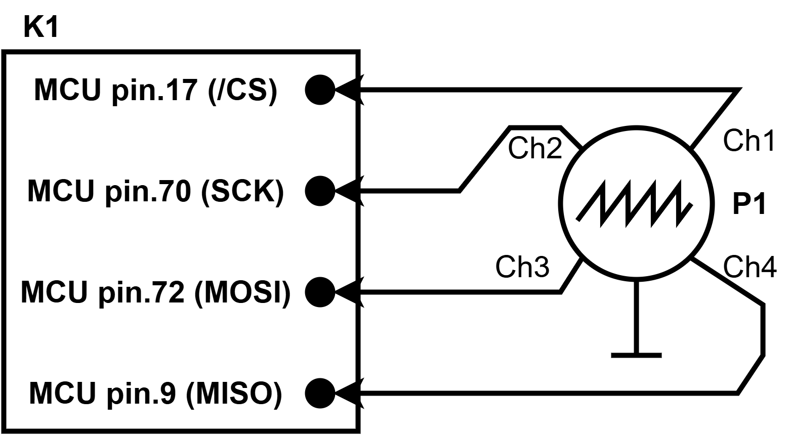
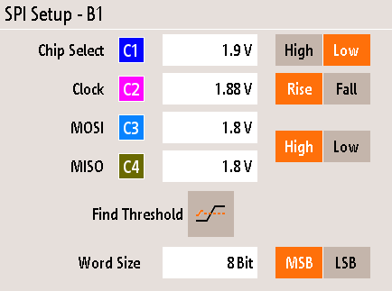
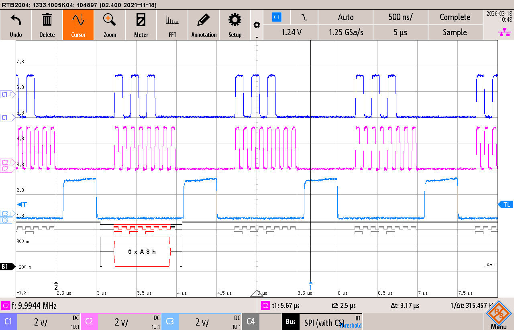
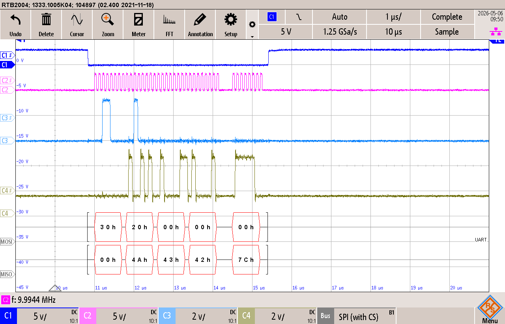

# 2418 Demonstrateur graphique
## Objectif

Développer une librairie complète pour pouvoir piloter l'écran **NHD-5.0R-FT812** avec le kit PIC32 de MINF.

## Versioning

**IDE**			: MPLABX IDE v6.15
**Configurateur**	: Harmony v2.06
**Compilateur**		: XC32 v2.50
**OS**			: Windows 10

## Mise en place d'une librairie (Mc32DriverFT812)
### Envoie des **Host Command**
Les **Host Command** sont envoyées au moyen de la fonction **ft812_send_host_command**, le format d'envoi des commandes est donné dans le datasheet **DS**DS_FT81x** de **Bridgetek**.
Ces commandes sont utilisées pour commander le chip **FT812**, elles servent à le mettre en mode **SLEEP** ou pour le **RESET** par exemple.

(Source => Page.16 de DS_FT81x)

Toutes les commandes sont listées dans le même datasheet de la page 16 à la page 20.

### Timing characteristics du TFT
Les réglages de base donnés au FT812 dans la fonction d'initialisation proviennent de la page 7 du datasheet **NHD-5.0-800480F-CTXL-T**.

### Adresses FT812

Toutes les adresses de la FT812 proviennent du datasse **DS_FT81x** de **Bridgetek**.

| Nom du registre   | Adresse       | Description                           |
| ----------------- | ------------- |:-------------------------------------:|
| REG_HSIZE         | 0x302034      | Horizontal display pixel count        |
| REG_VSIZE         | 0x302048      | Vertical display line count           |
| REG_HCYCLE        | 0x30202C      | Horizontal total cycle count          |
| REG_HOFFSET       | 0x302030      | Horizontal display start offset       |
| REG_HSYNC0        | 0x302038      | Horizontal sync fall offset           |
| REG_HSYNC1        | 0x30203C      | Horizontal sync rise offset           |
| REG_VCYCLE        | 0x302040      | Vertical total cycle count            |
| REG_VOFFSET       | 0x302044      | Vertical display start offset         |
| REG_VSYNC0        | 0x30204C      | Vertical sync fall offset             |
| REG_VSYNC1        | 0x302050      | Vertical sync rise offset             |
| REG_PCLK          | 0x302070      | PCLK frequency divider, 0 = disable   |
| REG_DLSWAP        | 0x302054      | Display list swap control             |
| RAM_DL            | 0x300000      | Display List RAM                      |

### Schéma de mesures pour le test des fonctions

### Configuration de l'oscilloscope pour les mesures SPI

### Test fonction **spi1_write8** pour écrire une donnée 8bits sur le bus SPI

Test d'envoie de la valeur **0xA8** sur le bus SPI à 10MHz

### Test fonction **ft812_memory_read8** pour lire une donnée 8bits sur le bus SPI

Lecture de REG_ID à l'adresse 0x302000 du chip ft812 pour test de la fonction.

Nous pouvons voir que le chip répond bien la valeur attendue qui est 0x7C.
